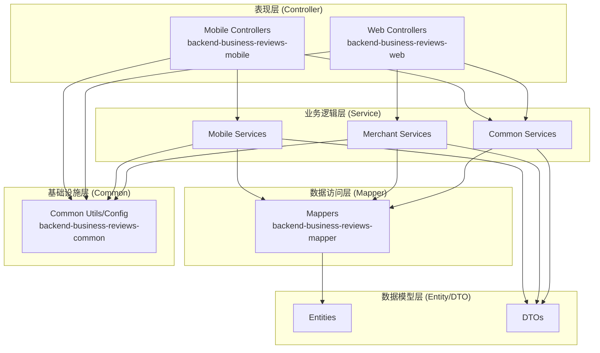

# Design Document: Backend Code Restructure

## Overview

本设计文档描述了对 backend-business-reviews 后端项目进行 MVC 架构分层重构的详细设计方案。重构目标是使代码结构更加清晰，明确区分 Mobile 端（UniApp）和 Web 端（商家运营中心）的代码。

## Architecture

### 重构后的模块架构

```
backend-business-reviews/
├── backend-business-reviews-common/     # 公共模块（基础设施层）
│   └── com.businessreviews/
│       ├── common/                      # 通用类（Result、Constants）
│       ├── config/                      # 配置类
│       ├── constants/                   # 常量定义
│       ├── context/                     # 上下文（UserContext）
│       ├── enums/                       # 枚举类
│       ├── exception/                   # 异常类
│       ├── handler/                     # 处理器（WebSocket等）
│       └── util/                        # 工具类
│
├── backend-business-reviews-entity/     # 实体模块（Model层）
│   └── com.businessreviews/
│       ├── entity/                      # 数据库实体
│       ├── common/                      # 通用响应类
│       └── dto/                         # 数据传输对象
│           ├── common/                  # 共用DTO
│           │   ├── request/
│           │   └── response/
│           ├── mobile/                  # Mobile端专用DTO
│           │   ├── request/
│           │   └── response/
│           └── merchant/                # Merchant端专用DTO
│               ├── request/
│               └── response/
│
├── backend-business-reviews-mapper/     # 数据访问模块（DAO层）
│   └── com.businessreviews/
│       └── mapper/                      # MyBatis Mapper接口
│
├── backend-business-reviews-service/    # 业务逻辑模块（Service层）
│   └── com.businessreviews/
│       ├── service/
│       │   ├── common/                  # 共用服务接口
│       │   ├── mobile/                  # Mobile端服务接口
│       │   └── merchant/                # Merchant端服务接口
│       └── service/impl/
│           ├── common/                  # 共用服务实现
│           ├── mobile/                  # Mobile端服务实现
│           └── merchant/                # Merchant端服务实现
│
├── backend-business-reviews-mobile/     # Mobile端控制器模块（Controller层-Mobile）
│   └── com.businessreviews/
│       ├── config/                      # Mobile端配置
│       ├── controller/                  # Mobile端Controller
│       ├── exception/                   # Mobile端异常处理
│       └── interceptor/                 # Mobile端拦截器
│
└── backend-business-reviews-web/        # Web端控制器模块（Controller层-Merchant）
    └── com.businessreviews/
        └── merchant/
            ├── config/                  # Merchant端配置
            ├── controller/              # Merchant端Controller
            ├── context/                 # Merchant端上下文
            ├── exception/               # Merchant端异常处理
            └── interceptor/             # Merchant端拦截器
```

### MVC分层架构图



## Components and Interfaces

### Service层组件划分

#### Mobile端服务（service/mobile/）
| 服务接口 | 说明 | 对应Controller |
|---------|------|----------------|
| AuthService | 用户认证服务 | AuthController |
| NoteService | 笔记服务 | NoteController |
| ShopService | 店铺服务 | ShopController |
| CommentService | 评论服务 | CommentController |
| UserService | 用户服务 | UserController |
| MessageService | 消息服务 | MessageController |
| CouponService | 优惠券服务 | CouponController |

#### Merchant端服务（service/merchant/）
| 服务接口 | 说明 | 对应Controller |
|---------|------|----------------|
| MerchantAuthService | 商家认证服务 | MerchantAuthController |
| MerchantNoteService | 商家笔记服务 | MerchantNoteController |
| MerchantShopService | 商家店铺服务 | MerchantShopController |
| MerchantCommentService | 商家评论服务 | MerchantCommentController |
| MerchantCouponService | 商家优惠券服务 | MerchantCouponController |
| MerchantDashboardService | 商家仪表盘服务 | MerchantDashboardController |

#### 共用服务（service/common/）
| 服务接口 | 说明 | 使用方 |
|---------|------|--------|
| OssService | OSS文件上传服务 | Mobile + Merchant |
| UploadService | 通用上传服务 | Mobile + Merchant |
| CommonService | 通用业务服务 | Mobile + Merchant |

### DTO组件划分

#### 共用DTO（dto/common/）
- PageResult - 分页结果
- 基础响应类

#### Mobile端DTO（dto/mobile/）
- request/: LoginByCodeRequest, PublishNoteRequest, SendCodeRequest等
- response/: LoginResponse, NoteDetailResponse, UserInfoResponse等

#### Merchant端DTO（dto/merchant/）
- request/: MerchantLoginRequest, MerchantRegisterRequest, CreateCouponRequest等
- response/: MerchantLoginResponse, MerchantUserInfoResponse等

## Data Models

### 实体类（保持不变）
所有Entity类保持在 `entity/` 包下，作为数据库表的映射，被所有端共用。

### DTO迁移映射表

| 原位置 | 新位置 | 说明 |
|-------|-------|------|
| dto/request/LoginByCodeRequest | dto/mobile/request/ | Mobile端登录 |
| dto/request/SendCodeRequest | dto/mobile/request/ | Mobile端验证码 |
| dto/request/PublishNoteRequest | dto/mobile/request/ | Mobile端发布笔记 |
| dto/request/MerchantLoginRequest | dto/merchant/request/ | Merchant端登录 |
| dto/request/MerchantRegisterRequest | dto/merchant/request/ | Merchant端注册 |
| dto/request/CreateCouponRequest | dto/merchant/request/ | Merchant端创建优惠券 |
| dto/response/LoginResponse | dto/mobile/response/ | Mobile端登录响应 |
| dto/response/MerchantLoginResponse | dto/merchant/response/ | Merchant端登录响应 |

## Correctness Properties

*A property is a characteristic or behavior that should hold true across all valid executions of a system-essentially, a formal statement about what the system should do. Properties serve as the bridge between human-readable specifications and machine-verifiable correctness guarantees.*

由于本次重构主要是代码组织结构的调整，不涉及业务逻辑变更，大部分验收标准属于代码组织和文档类要求，不适合自动化属性测试。以下是可验证的结构性属性：

### Property 1: 包结构完整性
*For any* 重构后的Service模块，mobile、merchant、common三个子包都应该存在且包含对应的服务类
**Validates: Requirements 1.1, 1.2, 1.3, 1.4**

### Property 2: DTO包结构完整性
*For any* 重构后的DTO模块，mobile、merchant、common三个子包都应该存在且包含request和response子包
**Validates: Requirements 2.1, 2.2, 2.3, 2.4**

### Property 3: 文档完整性
*For any* 模块目录，都应该存在README.md文件
**Validates: Requirements 3.1**

### Property 4: 架构文档存在性
*For any* 项目根目录，应该存在ARCHITECTURE.md文件
**Validates: Requirements 6.1**

## Error Handling

### 重构风险控制
1. **编译错误**: 移动文件后需要更新所有import语句
2. **依赖问题**: 确保模块间依赖关系正确
3. **运行时错误**: 确保Spring Bean扫描路径正确配置

### 回滚策略
- 使用Git进行版本控制，每个重构步骤单独提交
- 保留原有代码结构，通过新建包的方式进行迁移
- 完成迁移后再删除旧代码

## Testing Strategy

### 验证方法
由于本次重构不涉及业务逻辑变更，主要通过以下方式验证：

1. **编译验证**: 确保所有模块编译通过
2. **启动验证**: 确保Mobile和Web应用都能正常启动
3. **结构验证**: 检查包结构是否符合设计
4. **文档验证**: 检查README和ARCHITECTURE文档是否完整

### 测试框架
- Maven编译测试
- Spring Boot启动测试
- 手动API测试验证功能正常
