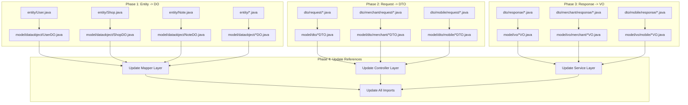

# Design Document: 后端代码结构重构

## Overview

本设计文档描述了按照《阿里巴巴Java开发手册》规范对后端项目进行彻底重构的详细方案。重构的核心目标是将现有的 `entity` 包和 `dto` 包下的类迁移到符合规范的包结构中。

### 当前项目结构

```
backend-business-reviews-entity/
└── com.businessreviews/
    ├── entity/                          # 需要迁移到 model.dataobject
    │   ├── User.java
    │   ├── Shop.java
    │   ├── Note.java
    │   └── ... (35个实体类)
    ├── dto/
    │   ├── request/                     # 需要迁移到 model.dto
    │   │   ├── LoginByCodeRequest.java
    │   │   └── ... (18个请求类)
    │   ├── response/                    # 需要迁移到 model.vo
    │   │   ├── UserInfoResponse.java
    │   │   └── ... (29个响应类)
    │   ├── merchant/
    │   │   ├── request/                 # 需要迁移到 model.dto.merchant
    │   │   └── response/                # 需要迁移到 model.vo.merchant
    │   └── mobile/
    │       ├── request/                 # 需要迁移到 model.dto.mobile
    │       └── response/                # 需要迁移到 model.vo.mobile
    └── model/                           # 已有部分重构的类
        ├── dataobject/
        ├── vo/
        └── query/
```

### 重构后目标结构

```
backend-business-reviews-entity/
└── com.businessreviews/
    ├── model/
    │   ├── dataobject/                  # DO对象（数据库映射）
    │   │   ├── UserDO.java
    │   │   ├── ShopDO.java
    │   │   ├── NoteDO.java
    │   │   └── ...
    │   ├── dto/                         # DTO对象（请求参数）
    │   │   ├── LoginByCodeDTO.java
    │   │   ├── merchant/
    │   │   │   └── MerchantLoginDTO.java
    │   │   └── mobile/
    │   │       └── LoginByCodeDTO.java
    │   ├── vo/                          # VO对象（响应数据）
    │   │   ├── UserInfoVO.java
    │   │   ├── merchant/
    │   │   │   └── MerchantLoginVO.java
    │   │   └── mobile/
    │   │       └── UserInfoVO.java
    │   └── query/                       # Query对象（查询条件）
    └── converter/                       # 对象转换器
```

## Architecture

### 迁移流程图



### 命名转换规则

| 原包路径 | 原类名 | 新包路径 | 新类名 |
|---------|--------|---------|--------|
| entity | User | model.dataobject | UserDO |
| dto.request | LoginByCodeRequest | model.dto | LoginByCodeDTO |
| dto.response | UserInfoResponse | model.vo | UserInfoVO |
| dto.merchant.request | MerchantLoginRequest | model.dto.merchant | MerchantLoginDTO |
| dto.merchant.response | MerchantLoginResponse | model.vo.merchant | MerchantLoginVO |
| dto.mobile.request | LoginByCodeRequest | model.dto.mobile | LoginByCodeDTO |
| dto.mobile.response | UserInfoResponse | model.vo.mobile | UserInfoVO |

## Components and Interfaces

### 1. Entity 迁移清单

需要迁移的 entity 包下的类（35个）：

| 原类名 | 新类名 | Boolean字段修正 |
|--------|--------|----------------|
| User | UserDO | - |
| Shop | ShopDO | - |
| Note | NoteDO | isRecommend -> recommend |
| Comment | CommentDO | - |
| Coupon | CouponDO | - |
| Merchant | MerchantDO | - |
| MerchantUser | MerchantUserDO | - |
| BrowseHistory | BrowseHistoryDO | - |
| Category | CategoryDO | - |
| ChatMessage | ChatMessageDO | - |
| ChatSession | ChatSessionDO | - |
| CommentLike | CommentLikeDO | - |
| Conversation | ConversationDO | - |
| Message | MessageDO | - |
| NoteComment | NoteCommentDO | - |
| NoteTag | NoteTagDO | - |
| NoteTopic | NoteTopicDO | - |
| Notification | NotificationDO | - |
| PrivateMessage | PrivateMessageDO | - |
| SearchHistory | SearchHistoryDO | - |
| ShopReview | ShopReviewDO | - |
| ShopTag | ShopTagDO | - |
| SystemNotice | SystemNoticeDO | - |
| Tag | TagDO | - |
| Topic | TopicDO | - |
| UserBrowseHistory | UserBrowseHistoryDO | - |
| UserCommentLike | UserCommentLikeDO | - |
| UserCoupon | UserCouponDO | - |
| UserFavorite | UserFavoriteDO | - |
| UserFollow | UserFollowDO | - |
| UserNoteBookmark | UserNoteBookmarkDO | - |
| UserNoteLike | UserNoteLikeDO | - |
| UserShopFavorite | UserShopFavoriteDO | - |
| UserStats | UserStatsDO | - |
| VerificationCode | VerificationCodeDO | - |

### 2. Request 迁移清单

需要迁移的 dto.request 包下的类（18个）：

| 原类名 | 新类名 |
|--------|--------|
| AddCommentRequest | AddCommentDTO |
| ChangePasswordRequest | ChangePasswordDTO |
| ChangePhoneRequest | ChangePhoneDTO |
| CreateCouponRequest | CreateCouponDTO |
| FollowRequest | FollowDTO |
| FollowUserRequest | FollowUserDTO |
| LoginByCodeRequest | LoginByCodeDTO |
| LoginByPasswordRequest | LoginByPasswordDTO |
| MarkNoticesReadRequest | MarkNoticesReadDTO |
| MerchantLoginRequest | MerchantLoginDTO |
| MerchantRegisterRequest | MerchantRegisterDTO |
| OAuthLoginRequest | OAuthLoginDTO |
| PostCommentRequest | PostCommentDTO |
| PostShopReviewRequest | PostShopReviewDTO |
| PublishNoteRequest | PublishNoteDTO |
| SendCodeRequest | SendCodeDTO |
| SendMessageRequest | SendMessageDTO |
| UpdateUserInfoRequest | UpdateUserInfoDTO |

### 3. Response 迁移清单

需要迁移的 dto.response 包下的类（29个）：

| 原类名 | 新类名 |
|--------|--------|
| CategoryResponse | CategoryVO |
| ChatListItemResponse | ChatListItemVO |
| ChatMessageResponse | ChatMessageVO |
| CommentResponse | CommentVO |
| ConversationItemResponse | ConversationItemVO |
| ConversationResponse | ConversationVO |
| CouponDetailResponse | CouponDetailVO |
| CouponItemResponse | CouponItemVO |
| FavoriteItemResponse | FavoriteItemVO |
| HistoryItemResponse | HistoryItemVO |
| LoginResponse | LoginVO |
| MerchantLoginResponse | MerchantLoginVO |
| MerchantUserInfoResponse | MerchantUserInfoVO |
| MessageResponse | MessageVO |
| NoteDetailResponse | NoteDetailVO |
| NoteItemResponse | NoteItemVO |
| NoteListItemResponse | NoteListItemVO |
| NoticeResponse | NoticeVO |
| NotificationResponse | NotificationVO |
| PrivateMessageResponse | PrivateMessageVO |
| ShopDetailResponse | ShopDetailVO |
| ShopItemResponse | ShopItemVO |
| ShopListItemResponse | ShopListItemVO |
| ShopReviewResponse | ShopReviewVO |
| TopicResponse | TopicVO |
| UnreadCountResponse | UnreadCountVO |
| UserInfoResponse | UserInfoVO |
| UserItemResponse | UserItemVO |
| UserProfileResponse | UserProfileVO |

## Data Models

### Boolean 字段处理示例

```java
// 重构前
@Data
@TableName("notes")
public class Note {
    private Long id;
    private Boolean isRecommend;  // 违反规范
    private Boolean isDeleted;    // 违反规范
}

// 重构后
@Data
@TableName("notes")
public class NoteDO {
    private Long id;
    
    @JsonProperty("isRecommend")  // 保持JSON字段名不变
    private Boolean recommend;
    
    @JsonProperty("isDeleted")    // 保持JSON字段名不变
    private Boolean deleted;
}
```

### Import 更新示例

```java
// 重构前
import com.businessreviews.entity.User;
import com.businessreviews.dto.request.LoginByCodeRequest;
import com.businessreviews.dto.response.UserInfoResponse;

// 重构后
import com.businessreviews.model.dataobject.UserDO;
import com.businessreviews.model.dto.LoginByCodeDTO;
import com.businessreviews.model.vo.UserInfoVO;
```

## Correctness Properties

*A property is a characteristic or behavior that should hold true across all valid executions of a system-essentially, a formal statement about what the system should do. Properties serve as the bridge between human-readable specifications and machine-verifiable correctness guarantees.*

### Property 1: DO 类命名规范
*For any* 位于 `com.businessreviews.model.dataobject` 包下的类，类名 SHALL 以 "DO" 结尾
**Validates: Requirements 1.2**

### Property 2: DTO 类命名规范
*For any* 位于 `com.businessreviews.model.dto` 包及其子包下的类，类名 SHALL 以 "DTO" 结尾
**Validates: Requirements 2.4**

### Property 3: VO 类命名规范
*For any* 位于 `com.businessreviews.model.vo` 包及其子包下的类，类名 SHALL 以 "VO" 结尾
**Validates: Requirements 3.4**

### Property 4: Boolean 字段命名规范
*For any* DO、DTO、VO 类中的 Boolean 类型字段，字段名 SHALL 不以 "is" 开头
**Validates: Requirements 1.3, 5.1**

### Property 5: Boolean 字段 JSON 兼容性
*For any* 被重命名的 Boolean 字段（原名以 is 开头），该字段 SHALL 包含 @JsonProperty 注解以保持 JSON 序列化兼容性
**Validates: Requirements 1.4, 5.2**

## Error Handling

### 迁移过程中的错误处理

1. **编译错误**: 迁移后立即编译验证，确保所有引用都已更新
2. **运行时错误**: 通过 @JsonProperty 注解确保 JSON 序列化兼容性
3. **回滚策略**: 使用 Git 版本控制，每个阶段完成后提交，便于回滚

## Testing Strategy

### 测试框架选择

- **属性测试**: jqwik (Java Property-Based Testing)
- **编译验证**: Maven 编译

### 属性测试策略

使用 jqwik 框架进行属性测试，验证以下属性：

1. **DO 命名规范属性** - 通过反射扫描 model.dataobject 包，验证类名以 DO 结尾
2. **DTO 命名规范属性** - 通过反射扫描 model.dto 包，验证类名以 DTO 结尾
3. **VO 命名规范属性** - 通过反射扫描 model.vo 包，验证类名以 VO 结尾
4. **Boolean 字段命名属性** - 通过反射扫描所有 POJO 类的 Boolean 字段，验证不以 is 开头

### 测试示例

```java
@PropertyDefaults(tries = 1)
class DONamingPropertyTest {
    
    @Property
    void allDOClassesShouldEndWithDO() {
        Reflections reflections = new Reflections("com.businessreviews.model.dataobject");
        Set<Class<?>> classes = reflections.getSubTypesOf(Object.class);
        
        for (Class<?> clazz : classes) {
            assertThat(clazz.getSimpleName()).endsWith("DO");
        }
    }
}
```
