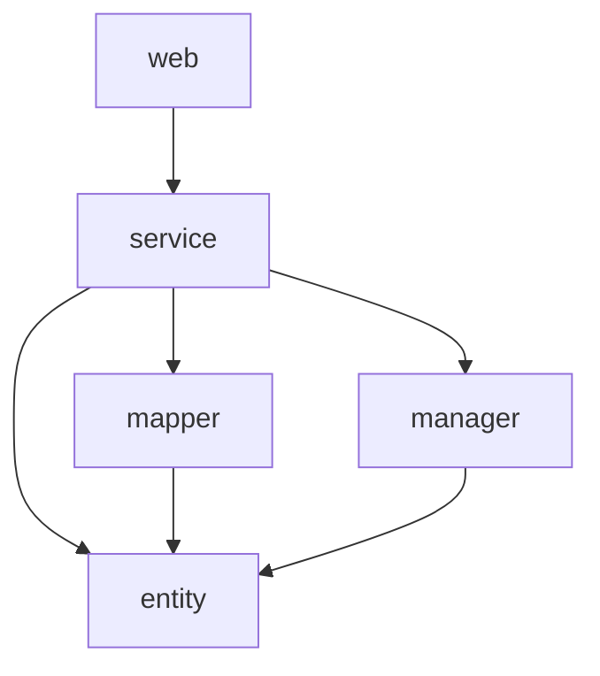

# Design Document: Alibaba Package Restructure

## Overview

本设计文档描述了基于阿里巴巴Java开发手册对 business-reviews 后端项目进行包结构重构的技术方案。重构的核心目标是：

1. 清晰分离商户端（Merchant）和用户端（App/Mobile）的业务逻辑
2. 清理历史遗留的 `refactored` 包和重复代码
3. 确保 Mapper 模块只包含接口，DO 类全部在 Entity 模块
4. 统一命名规范，符合阿里巴巴Java开发手册要求

## Architecture

### 目标包结构

```
backend-business-reviews/
├── backend-business-reviews-web/
│   └── src/main/java/com/businessreviews/
│       ├── web/
│       │   ├── app/                    # 用户端控制器
│       │   │   ├── AuthController.java
│       │   │   ├── UserController.java
│       │   │   ├── ShopController.java
│       │   │   ├── NoteController.java
│       │   │   ├── CommentController.java
│       │   │   ├── CouponController.java
│       │   │   ├── MessageController.java
│       │   │   ├── CommonController.java
│       │   │   └── UploadController.java
│       │   └── merchant/               # 商户端控制器
│       │       ├── MerchantAuthController.java
│       │       ├── MerchantShopController.java
│       │       ├── MerchantNoteController.java
│       │       ├── MerchantCommentController.java
│       │       ├── MerchantCouponController.java
│       │       ├── MerchantDashboardController.java
│       │       └── MerchantUploadController.java
│       ├── config/
│       ├── interceptor/
│       └── exception/
│
├── backend-business-reviews-service/
│   └── src/main/java/com/businessreviews/
│       └── service/
│           ├── app/                    # 用户端服务接口
│           │   ├── AuthService.java
│           │   ├── UserService.java
│           │   ├── ShopService.java
│           │   ├── NoteService.java
│           │   ├── CommentService.java
│           │   └── MessageService.java
│           ├── merchant/               # 商户端服务接口
│           │   ├── MerchantAuthService.java
│           │   ├── MerchantShopService.java
│           │   ├── MerchantNoteService.java
│           │   ├── MerchantCommentService.java
│           │   ├── MerchantCouponService.java
│           │   └── MerchantDashboardService.java
│           ├── common/                 # 公共服务接口
│           │   ├── CommonService.java
│           │   ├── OssService.java
│           │   └── UploadService.java
│           └── impl/
│               ├── app/                # 用户端服务实现
│               ├── merchant/           # 商户端服务实现
│               └── common/             # 公共服务实现
│
├── backend-business-reviews-entity/
│   └── src/main/java/com/businessreviews/
│       ├── model/
│       │   ├── dataobject/             # 所有DO类
│       │   ├── dto/
│       │   │   ├── app/                # 用户端DTO
│       │   │   └── merchant/           # 商户端DTO
│       │   ├── vo/
│       │   │   ├── app/                # 用户端VO
│       │   │   └── merchant/           # 商户端VO
│       │   └── query/
│       └── converter/
│
├── backend-business-reviews-mapper/
│   └── src/main/java/com/businessreviews/
│       └── mapper/                     # 只包含Mapper接口，无子包
│
└── backend-business-reviews-manager/
    └── src/main/java/com/businessreviews/
        └── manager/
            ├── OssManager.java
            └── SmsManager.java
```

### 层次依赖关系



## Components and Interfaces

### 1. Controller Layer (web)

#### 1.1 App Controllers (`web.app`)

| Controller | 职责 | 依赖的Service |
|------------|------|---------------|
| AuthController | 用户认证（登录、注册、验证码） | AuthService |
| UserController | 用户信息管理 | UserService |
| ShopController | 商家浏览、搜索、收藏 | ShopService |
| NoteController | 笔记浏览、发布、互动 | NoteService |
| CommentController | 评论管理 | CommentService |
| CouponController | 优惠券领取、使用 | CouponService |
| MessageController | 消息通知 | MessageService |
| CommonController | 公共接口（分类、标签等） | CommonService |
| UploadController | 文件上传 | UploadService |

#### 1.2 Merchant Controllers (`web.merchant`)

| Controller | 职责 | 依赖的Service |
|------------|------|---------------|
| MerchantAuthController | 商户认证 | MerchantAuthService |
| MerchantShopController | 店铺管理 | MerchantShopService |
| MerchantNoteController | 笔记管理 | MerchantNoteService |
| MerchantCommentController | 评论管理 | MerchantCommentService |
| MerchantCouponController | 优惠券管理 | MerchantCouponService |
| MerchantDashboardController | 数据看板 | MerchantDashboardService |
| MerchantUploadController | 文件上传 | UploadService |

### 2. Service Layer

#### 2.1 Service Interface Organization

```java
// 用户端服务接口示例
package com.businessreviews.service.app;

public interface UserService {
    UserVO getById(Long userId);
    UserVO getUserProfile(Long userId);
    void updateUserInfo(Long userId, UpdateUserInfoDTO dto);
    // ...
}

// 商户端服务接口示例
package com.businessreviews.service.merchant;

public interface MerchantShopService {
    ShopVO getShopById(Long shopId, Long merchantId);
    PageResult<ShopVO> listShops(Long merchantId, ShopQuery query);
    Long saveShop(Long merchantId, ShopDTO dto);
    // ...
}

// 公共服务接口示例
package com.businessreviews.service.common;

public interface CommonService {
    List<CategoryVO> listCategories();
    List<TagVO> listTags();
    // ...
}
```

#### 2.2 Service Implementation Organization

```java
// 用户端服务实现
package com.businessreviews.service.impl.app;

@Service
public class UserServiceImpl implements UserService {
    // ...
}

// 商户端服务实现
package com.businessreviews.service.impl.merchant;

@Service
public class MerchantShopServiceImpl implements MerchantShopService {
    // ...
}

// 公共服务实现
package com.businessreviews.service.impl.common;

@Service
public class CommonServiceImpl implements CommonService {
    // ...
}
```

### 3. Mapper Layer

所有 Mapper 接口统一放在 `mapper` 包根目录：

```java
package com.businessreviews.mapper;

@Mapper
public interface UserMapper extends BaseMapper<UserDO> {
    // ...
}

@Mapper
public interface ShopMapper extends BaseMapper<ShopDO> {
    // ...
}
```

**清理任务**：
- 删除 `mapper.dataobject` 子包
- 合并重复的 Mapper 接口（如 `UserMapper` 和 `UserDOMapper`）

### 4. Manager Layer

Manager 层封装第三方服务调用：

```java
package com.businessreviews.manager;

@Component
public class OssManager {
    public String uploadFile(MultipartFile file, String directory);
    public void removeFile(String fileUrl);
    public String generatePresignedUrl(String objectKey);
}

@Component
public class SmsManager {
    public void sendVerificationCode(String phone, String code);
}
```

## Data Models

### DO (Data Object) 命名规范

所有 DO 类必须：
- 位于 `model.dataobject` 包
- 类名以 `DO` 结尾
- 使用包装类型（Integer, Long, Boolean 等）
- Boolean 字段不使用 `is` 前缀

```java
package com.businessreviews.model.dataobject;

@Data
@TableName("user")
public class UserDO {
    private Long id;
    private String phone;
    private String nickname;
    private Boolean deleted;  // 不是 isDeleted
    // ...
}
```

### DTO/VO 组织

```
model/
├── dto/
│   ├── LoginByCodeDTO.java          # 共享DTO
│   ├── SendCodeDTO.java
│   ├── app/
│   │   ├── UpdateUserInfoDTO.java   # 用户端专用
│   │   └── PublishNoteDTO.java
│   └── merchant/
│       ├── MerchantLoginDTO.java    # 商户端专用
│       └── CreateCouponDTO.java
└── vo/
    ├── CategoryVO.java              # 共享VO
    ├── app/
    │   ├── UserProfileVO.java       # 用户端专用
    │   └── NoteDetailVO.java
    └── merchant/
        ├── MerchantDashboardVO.java # 商户端专用
        └── ShopStatisticsVO.java
```

## Correctness Properties

*A property is a characteristic or behavior that should hold true across all valid executions of a system-essentially, a formal statement about what the system should do. Properties serve as the bridge between human-readable specifications and machine-verifiable correctness guarantees.*

### Property 1: Controller Package Organization

*For any* Controller class in the project, if it serves the mobile/app client, it should be located in the `web.app` package; if it serves the merchant client, it should be located in the `web.merchant` package.

**Validates: Requirements 1.1, 1.2**

### Property 2: Service Interface Package Organization

*For any* Service interface in the project, it should be located in exactly one of: `service.app`, `service.merchant`, or `service.common` packages, with no duplicates at the root `service` package level.

**Validates: Requirements 2.1, 2.2, 2.3, 2.4**

### Property 3: Service Implementation Package Organization

*For any* Service implementation class, it should be located in the corresponding `service.impl.{app|merchant|common}` sub-package matching its interface location.

**Validates: Requirements 3.1, 3.2, 3.3, 3.4**

### Property 4: Mapper Package Cleanliness

*For any* Mapper interface in the project, it should be located directly in the `mapper` package root with no sub-packages containing Mapper interfaces.

**Validates: Requirements 5.1, 5.2**

### Property 5: DO Class Location

*For any* DO (Data Object) class in the project, it should be located in the `backend-business-reviews-entity` module under the `model.dataobject` package.

**Validates: Requirements 6.1, 6.2**

### Property 6: POJO Naming Convention

*For any* POJO class in the project:
- If it's a database entity, its name should end with `DO`
- If it's a data transfer object, its name should end with `DTO`
- If it's a view object, its name should end with `VO`
- If it's a Service interface, its name should follow `XxxService` pattern
- If it's a Service implementation, its name should follow `XxxServiceImpl` pattern

**Validates: Requirements 8.1, 8.2, 8.3, 8.4, 8.5**

### Property 7: Manager Layer Injection

*For any* Manager class (OssManager, SmsManager), it should only be injected into Service layer classes, not into Controller or Mapper layers.

**Validates: Requirements 9.4**

### Property 8: Refactored Package Removal

*For any* class in the project, there should be no class located in the `service.refactored` package after refactoring is complete.

**Validates: Requirements 4.3, 4.4**

## Error Handling

### 重构过程中的错误处理

1. **编译错误**：每次移动文件后立即运行 `mvn compile` 验证
2. **循环依赖**：使用 `@Lazy` 注解或重构依赖关系
3. **Bean 冲突**：确保每个接口只有一个实现类被 Spring 管理
4. **Import 错误**：使用 IDE 的自动修复功能批量更新 import

### 回滚策略

1. 使用 Git 分支进行重构
2. 每完成一个模块的重构后提交
3. 如遇到无法解决的问题，可回滚到上一个稳定提交

## Testing Strategy

### 单元测试

- 重构后运行所有现有单元测试确保功能不变
- 新增包结构验证测试

### 属性测试

使用 JUnit 5 和反射 API 进行属性测试：

```java
@Test
void testControllerPackageOrganization() {
    // 扫描所有Controller类，验证包位置
}

@Test
void testServiceInterfacePackageOrganization() {
    // 扫描所有Service接口，验证包位置
}

@Test
void testNamingConvention() {
    // 扫描所有POJO类，验证命名规范
}
```

### 集成测试

- 启动 Spring 应用上下文，验证 Bean 注入
- 调用主要 API 端点，验证功能正常

### 测试框架

- JUnit 5 用于单元测试和属性测试
- Spring Boot Test 用于集成测试
- jqwik 或 QuickTheories 用于属性基测试（可选）
