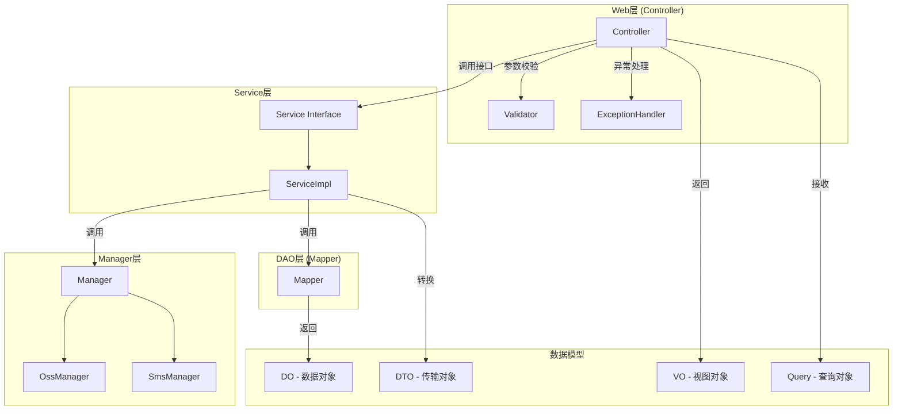
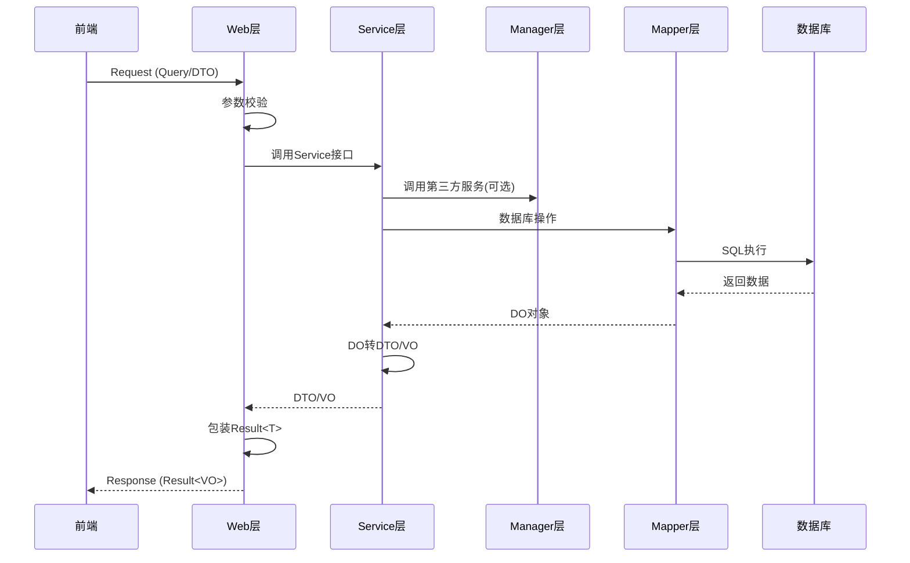

# Design Document: 后端代码重构（阿里巴巴Java开发手册规范）

## Overview

本设计文档描述了按照《阿里巴巴Java开发手册》规范对后端项目进行重构的详细方案。重构涉及三个主要方面：

1. **项目分层结构优化** - 明确Web层、Service层、Mapper层、Manager层的职责边界
2. **领域模型拆分** - 将现有Entity拆分为DO/DTO/VO/Query
3. **命名与代码细节规范化** - 方法命名、Boolean字段、数据类型规范

### 当前项目结构分析

```
backend-business-reviews/
├── backend-business-reviews-common/     # 公共模块（工具类、常量、异常等）
├── backend-business-reviews-entity/     # 实体模块（当前混合了Entity和DTO）
├── backend-business-reviews-mapper/     # 数据访问层
├── backend-business-reviews-service/    # 服务层
├── backend-business-reviews-web/        # Web层（商家端）
└── backend-business-reviews-mobile/     # 移动端API
```

### 重构后目标结构

```
backend-business-reviews/
├── backend-business-reviews-common/     # 公共模块
│   └── com.businessreviews
│       ├── common/                      # 通用类（Result、PageResult等）
│       ├── config/                      # 配置类
│       ├── constants/                   # 常量
│       ├── enums/                       # 枚举
│       ├── exception/                   # 异常
│       └── util/                        # 工具类
├── backend-business-reviews-entity/     # 实体模块（重构）
│   └── com.businessreviews
│       ├── model/
│       │   ├── do/                      # DO对象（数据库映射）
│       │   ├── dto/                     # DTO对象（数据传输）
│       │   ├── vo/                      # VO对象（视图展示）
│       │   └── query/                   # Query对象（查询条件）
│       └── converter/                   # 对象转换器
├── backend-business-reviews-mapper/     # 数据访问层
├── backend-business-reviews-service/    # 服务层
│   └── com.businessreviews.service
│       ├── XxxService.java              # 接口
│       └── impl/
│           └── XxxServiceImpl.java      # 实现
├── backend-business-reviews-manager/    # Manager层（新增）
│   └── com.businessreviews.manager
│       ├── OssManager.java              # OSS管理
│       └── SmsManager.java              # 短信管理
└── backend-business-reviews-web/        # Web层
```

## Architecture

### 分层架构图



### 数据流转图



## Components and Interfaces

### 1. Web层组件

#### Controller规范
- 职责：参数校验、异常捕获、业务转发
- 禁止：包含核心业务逻辑
- 返回值：统一使用`Result<T>`包装

```java
@RestController
@RequestMapping("/api/user")
@RequiredArgsConstructor
public class UserController {
    
    private final UserService userService;  // 依赖接口，非实现类
    
    @GetMapping("/{id}")
    public Result<UserVO> getById(@PathVariable Long id) {
        UserVO vo = userService.getById(id);
        return Result.success(vo);
    }
    
    @PostMapping("/list")
    public Result<PageResult<UserVO>> listUsers(@RequestBody @Valid UserQuery query) {
        PageResult<UserVO> result = userService.listUsers(query);
        return Result.success(result);
    }
}
```

### 2. Service层组件

#### Service接口规范
```java
public interface UserService {
    UserVO getById(Long id);
    PageResult<UserVO> listUsers(UserQuery query);
    void saveUser(UserDTO dto);
    void updateUser(UserDTO dto);
    void removeById(Long id);
    Long countByStatus(Integer status);
}
```

#### ServiceImpl规范
```java
@Service
@RequiredArgsConstructor
public class UserServiceImpl implements UserService {
    
    private final UserMapper userMapper;
    private final UserConverter userConverter;
    
    @Override
    public UserVO getById(Long id) {
        UserDO userDO = userMapper.selectById(id);
        return userConverter.toVO(userDO);
    }
}
```

### 3. Manager层组件

#### OssManager
```java
@Component
@RequiredArgsConstructor
public class OssManager {
    
    private final OSSClient ossClient;
    
    public String uploadFile(MultipartFile file, String path) {
        // OSS上传逻辑
    }
    
    public void removeFile(String url) {
        // OSS删除逻辑
    }
}
```

### 4. Mapper层组件

```java
@Mapper
public interface UserMapper extends BaseMapper<UserDO> {
    
    UserDO selectByPhone(String phone);
    
    List<UserDO> listByStatus(Integer status);
    
    Long countByStatus(Integer status);
}
```

## Data Models

### 1. DO (Data Object) - 数据库映射对象

位置：`com.businessreviews.model.do`

```java
@Data
@TableName("users")
public class UserDO implements Serializable {
    
    @TableId(type = IdType.AUTO)
    private Long id;
    
    private String phone;
    private String username;
    private String avatar;
    private String bio;
    private String password;
    private Integer gender;
    private LocalDate birthday;
    private Integer status;          // 使用包装类型
    private Boolean deleted;         // 禁止is前缀
    
    @TableField(fill = FieldFill.INSERT)
    private LocalDateTime createdAt;
    
    @TableField(fill = FieldFill.INSERT_UPDATE)
    private LocalDateTime updatedAt;
}
```

### 2. DTO (Data Transfer Object) - 数据传输对象

位置：`com.businessreviews.model.dto`

```java
@Data
public class UserDTO implements Serializable {
    
    private Long id;
    private String phone;
    private String username;
    private String avatar;
    private String bio;
    private Integer gender;
    private LocalDate birthday;
}
```

### 3. VO (View Object) - 视图展示对象

位置：`com.businessreviews.model.vo`

```java
@Data
public class UserVO implements Serializable {
    
    private String userId;           // ID转字符串，避免前端精度丢失
    private String username;
    private String avatar;
    private String bio;
    private String phone;            // 脱敏：138****1234
    private Integer gender;
    private String birthday;
    
    // 统计信息
    private Integer followingCount;
    private Integer followerCount;
    private Integer noteCount;
}
```

### 4. Query (查询对象)

位置：`com.businessreviews.model.query`

```java
@Data
public class UserQuery implements Serializable {
    
    private String keyword;          // 搜索关键词
    private Integer status;          // 状态筛选
    private Integer gender;          // 性别筛选
    private LocalDate startDate;     // 开始日期
    private LocalDate endDate;       // 结束日期
    
    @Min(1)
    private Integer pageNum = 1;
    
    @Min(1)
    @Max(100)
    private Integer pageSize = 10;
}
```

### 5. 对象转换器

位置：`com.businessreviews.converter`

```java
@Component
public class UserConverter {
    
    public UserVO toVO(UserDO userDO) {
        if (userDO == null) {
            return null;
        }
        UserVO vo = new UserVO();
        BeanUtils.copyProperties(userDO, vo);
        vo.setUserId(userDO.getId().toString());
        vo.setPhone(maskPhone(userDO.getPhone()));
        return vo;
    }
    
    public UserDO toDO(UserDTO dto) {
        if (dto == null) {
            return null;
        }
        UserDO userDO = new UserDO();
        BeanUtils.copyProperties(dto, userDO);
        return userDO;
    }
    
    public List<UserVO> toVOList(List<UserDO> doList) {
        return doList.stream()
                .map(this::toVO)
                .collect(Collectors.toList());
    }
    
    private String maskPhone(String phone) {
        if (phone == null || phone.length() != 11) {
            return phone;
        }
        return phone.substring(0, 3) + "****" + phone.substring(7);
    }
}
```

## Correctness Properties

*A property is a characteristic or behavior that should hold true across all valid executions of a system-essentially, a formal statement about what the system should do. Properties serve as the bridge between human-readable specifications and machine-verifiable correctness guarantees.*

基于需求分析，以下是可测试的正确性属性：

### Property 1: API响应格式一致性
*For any* API请求，Controller返回的响应对象 SHALL 符合Result<T>格式，包含code、message、data字段
**Validates: Requirements 1.2**

### Property 2: DO类命名规范
*For any* 位于model.do包下的类，类名 SHALL 以"DO"结尾
**Validates: Requirements 2.1**

### Property 3: DTO类命名规范
*For any* 位于model.dto包下的类，类名 SHALL 以"DTO"结尾
**Validates: Requirements 2.2**

### Property 4: VO类命名规范
*For any* 位于model.vo包下的类，类名 SHALL 以"VO"结尾
**Validates: Requirements 2.3**

### Property 5: 对象转换正确性
*For any* DO对象，通过Converter转换为VO后，非敏感字段的值 SHALL 保持一致
**Validates: Requirements 2.5**

### Property 6: 手机号脱敏正确性
*For any* 11位手机号，脱敏后的格式 SHALL 为"前3位****后4位"
**Validates: Requirements 2.3**

### Property 7: Boolean字段命名规范
*For any* POJO类中的Boolean类型字段，字段名 SHALL 不以"is"开头
**Validates: Requirements 4.1**

### Property 8: POJO属性类型规范
*For any* POJO类中的数值类型属性，类型 SHALL 为包装类型（Integer/Long/Double等）而非基本类型
**Validates: Requirements 5.1**

### Property 9: Service方法返回类型规范
*For any* Service接口中返回数值的方法，返回类型 SHALL 为包装类型
**Validates: Requirements 5.2**

## Error Handling

### 统一异常处理

```java
@RestControllerAdvice
public class GlobalExceptionHandler {
    
    @ExceptionHandler(BusinessException.class)
    public Result<?> handleBusinessException(BusinessException e) {
        return Result.error(e.getCode(), e.getMessage());
    }
    
    @ExceptionHandler(MethodArgumentNotValidException.class)
    public Result<?> handleValidationException(MethodArgumentNotValidException e) {
        String message = e.getBindingResult().getFieldErrors().stream()
                .map(FieldError::getDefaultMessage)
                .collect(Collectors.joining(", "));
        return Result.error(400, message);
    }
    
    @ExceptionHandler(Exception.class)
    public Result<?> handleException(Exception e) {
        log.error("系统异常", e);
        return Result.error(500, "系统繁忙，请稍后重试");
    }
}
```

## Testing Strategy

### 测试框架选择

- **单元测试**: JUnit 5 + Mockito
- **属性测试**: jqwik (Java Property-Based Testing)
- **集成测试**: Spring Boot Test

### 单元测试策略

1. **Converter测试** - 验证DO/DTO/VO转换的正确性
2. **Service测试** - 验证业务逻辑的正确性
3. **Controller测试** - 验证API响应格式

### 属性测试策略

使用jqwik框架进行属性测试，验证以下属性：

1. **命名规范属性** - 通过反射扫描类和方法，验证命名符合规范
2. **类型规范属性** - 验证POJO字段类型为包装类型
3. **转换正确性属性** - 验证对象转换的字段值一致性
4. **脱敏正确性属性** - 验证手机号脱敏格式

### 测试示例

```java
@PropertyDefaults(tries = 100)
class UserConverterPropertyTest {
    
    @Provide
    Arbitrary<String> phones() {
        return Arbitraries.strings()
                .numeric()
                .ofLength(11)
                .filter(s -> s.startsWith("1"));
    }
    
    @Property
    void phoneMaskingFormat(@ForAll("phones") String phone) {
        String masked = maskPhone(phone);
        assertThat(masked).matches("\\d{3}\\*{4}\\d{4}");
        assertThat(masked.substring(0, 3)).isEqualTo(phone.substring(0, 3));
        assertThat(masked.substring(7)).isEqualTo(phone.substring(7));
    }
}
```
