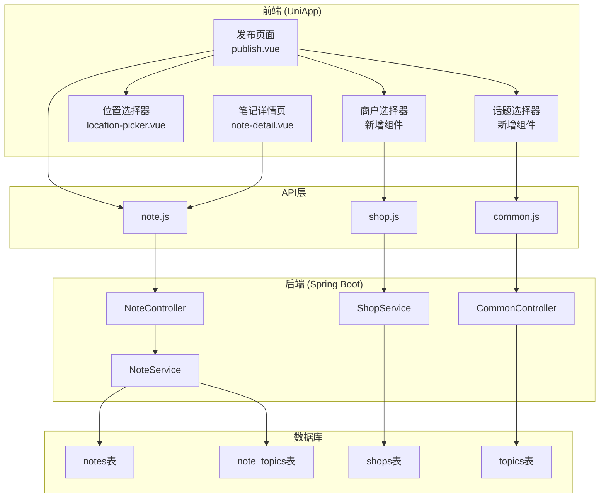

# Design Document: Note Publish Optimization

## Overview

本设计文档描述了发布笔记功能的优化方案，包括前端页面改造和后端接口增强。主要涉及：
1. 关联商户功能 - 支持选择已注册商户
2. 话题功能 - 支持添加和显示话题
3. 位置功能 - 支持定位选择和显示
4. 删除冗余功能 - 移除标签、公开设置、表情和@功能
5. 页面美化 - 优化UI布局和样式

## Architecture



## Components and Interfaces

### 1. 前端组件

#### 1.1 发布页面 (publish.vue) 改造

**删除的功能：**
- 删除"添加标签"选项及相关逻辑
- 删除"公开"可见性选项及相关逻辑
- 删除底部工具栏的表情按钮
- 删除底部工具栏的@按钮

**新增/修改的功能：**
- 关联商户：改为弹出商户选择列表（仅显示已注册商户）
- 添加话题：改为弹出话题选择列表，支持多选（最多5个）
- 添加位置：保持现有跳转逻辑，优化显示效果
- 发布时默认status=1（公开）

#### 1.2 笔记详情页 (note-detail.vue) 改造

**新增显示内容：**
- 商户信息区域：显示关联商户名称，可点击跳转商户详情
- 话题标签区域：显示话题列表，以#开头，可点击
- 位置信息区域：显示位置名称，带位置图标，可点击查看地图

### 2. 后端接口

#### 2.1 获取已注册商户列表 (新增)

```
GET /api/shops/registered
```

**请求参数：**
| 参数 | 类型 | 必填 | 说明 |
|------|------|------|------|
| keyword | String | 否 | 搜索关键词 |
| pageNum | Integer | 否 | 页码，默认1 |
| pageSize | Integer | 否 | 每页数量，默认20 |

**响应：**
```json
{
  "code": 200,
  "data": {
    "list": [
      {
        "id": 1,
        "name": "商户名称",
        "headerImage": "封面图URL",
        "address": "地址"
      }
    ],
    "total": 100,
    "pageNum": 1,
    "pageSize": 20
  }
}
```

#### 2.2 笔记详情响应增强

**NoteDetailResponse 新增字段：**
```java
// 话题列表
private List<TopicInfo> topics;

// 话题信息内部类
@Data
public static class TopicInfo {
    private Long id;
    private String name;
}
```

## Data Models

### 1. 数据库表结构

现有表结构已满足需求，无需修改：
- `notes` - 笔记表，包含shopId、location、latitude、longitude字段
- `note_topics` - 笔记话题关联表
- `shops` - 商户表，包含merchantId字段用于标识已注册商户
- `topics` - 话题表

### 2. 前端数据模型

```javascript
// 发布笔记数据
const noteData = {
  title: '',           // 标题
  content: '',         // 内容
  images: [],          // 图片URL数组
  shopId: null,        // 关联商户ID
  topics: [],          // 话题ID数组
  location: '',        // 位置名称
  latitude: null,      // 纬度
  longitude: null      // 经度
  // 移除: tags, status (默认公开)
}

// 选中的商户
const selectedShop = {
  id: 1,
  name: '商户名称',
  headerImage: '封面图',
  address: '地址'
}

// 选中的话题
const selectedTopics = [
  { id: 1, name: '美食探店' },
  { id: 2, name: '周末好去处' }
]
```

## Correctness Properties

*A property is a characteristic or behavior that should hold true across all valid executions of a system-essentially, a formal statement about what the system should do. Properties serve as the bridge between human-readable specifications and machine-verifiable correctness guarantees.*

Based on the prework analysis, the following properties have been identified:

### Property 1: Merchant association persistence
*For any* note published with a selected merchant, the note's shopId field SHALL equal the selected merchant's ID.
**Validates: Requirements 1.2**

### Property 2: Merchant display in note detail
*For any* note with a non-null shopId, the note detail response SHALL include the merchant name (shopName field).
**Validates: Requirements 1.3, 1.4**

### Property 3: Topic selection limit
*For any* topic selection operation, the system SHALL reject selections that would result in more than 5 topics.
**Validates: Requirements 2.2**

### Property 4: Topic display format
*For any* selected topic displayed in the UI, the topic name SHALL be prefixed with "#".
**Validates: Requirements 2.3, 2.4**

### Property 5: Topic persistence
*For any* note published with topics, the note_topics table SHALL contain one record for each topic ID associated with the note ID.
**Validates: Requirements 2.5**

### Property 6: Location data completeness
*For any* note published with a location, all three fields (location name, latitude, longitude) SHALL be non-null.
**Validates: Requirements 3.3**

### Property 7: Location display
*For any* note with a non-null location field, the note detail page SHALL display the location name.
**Validates: Requirements 3.4**

### Property 8: Default public status
*For any* note published through the optimized publish page, the note status SHALL be 1 (public).
**Validates: Requirements 4.5**

### Property 9: Selected items visual indication
*For any* selected item (merchant, topic, or location), the publish page SHALL display a visual indicator showing the selection.
**Validates: Requirements 5.5**

## Error Handling

### 前端错误处理

| 场景 | 处理方式 |
|------|----------|
| 商户列表加载失败 | 显示"加载失败，请重试"提示，提供重试按钮 |
| 话题列表加载失败 | 显示"加载失败，请重试"提示，提供重试按钮 |
| 位置获取失败 | 显示"定位失败"提示，允许手动搜索位置 |
| 发布失败 | 显示具体错误信息，保留已填写内容 |
| 话题选择超过5个 | 显示"最多选择5个话题"提示 |

### 后端错误处理

| 错误码 | 说明 | 处理方式 |
|--------|------|----------|
| 40001 | 参数错误 | 返回具体参数错误信息 |
| 40402 | 商户不存在 | 返回"商户不存在"错误 |
| 40403 | 话题不存在 | 返回"话题不存在"错误 |
| 50000 | 服务器错误 | 记录日志，返回通用错误信息 |

## Testing Strategy

### 单元测试

1. **NoteService测试**
   - 测试发布笔记时商户关联正确保存
   - 测试发布笔记时话题关联正确保存
   - 测试笔记详情返回完整的商户和话题信息

2. **前端组件测试**
   - 测试商户选择器正确显示商户列表
   - 测试话题选择器正确限制选择数量
   - 测试位置选择后数据正确传递

### 属性测试 (Property-Based Testing)

使用 **JUnit 5 + jqwik** 进行属性测试。

**测试配置：**
- 每个属性测试运行至少100次迭代
- 使用注释标记对应的正确性属性

**属性测试用例：**

1. **Property 1: Merchant association persistence**
   - 生成随机商户ID和笔记数据
   - 发布笔记后验证shopId正确保存

2. **Property 5: Topic persistence**
   - 生成随机话题ID列表（1-5个）
   - 发布笔记后验证note_topics表记录正确

3. **Property 8: Default public status**
   - 生成随机笔记数据（不设置status）
   - 发布后验证status=1

### 集成测试

1. **发布流程测试**
   - 完整的发布流程：选择商户 → 选择话题 → 选择位置 → 发布
   - 验证所有数据正确保存

2. **详情显示测试**
   - 发布带商户、话题、位置的笔记
   - 获取详情验证所有信息正确返回

