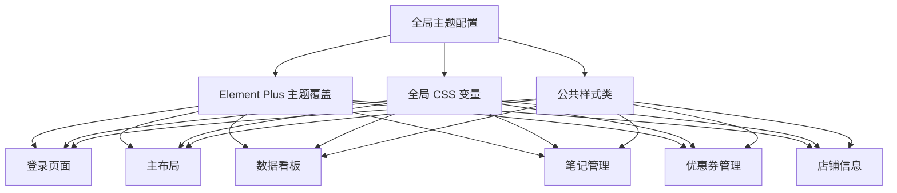

# Design Document: Web UI Redesign

## Overview

本设计文档描述了将 business-reviews Web 前端 UI 根据 dianp 设计原型图进行改造的技术方案。改造目标是使 Web 前端页面与设计原型图保持一致的视觉风格、颜色色调和交互体验。

### 设计原型图风格分析

根据对 dianp 设计原型图的分析，主要设计特点包括：

1. **色彩体系**
   - 主色调：橙色 (#FF7D00)
   - 辅助色：绿色 (#4CAF50)
   - 成功色：#10B981
   - 警告色：#F59E0B
   - 危险色：#EF4444
   - 信息色：#3B82F6
   - 中性色系：#F5F5F5 ~ #171717

2. **背景风格**
   - 渐变背景：从 yellow-50 到 green-50
   - 卡片背景：纯白色

3. **组件风格**
   - 圆角设计：卡片 12px，按钮 8px
   - 阴影效果：轻柔阴影 + 悬停加深
   - 过渡动画：300ms 平滑过渡

4. **字体**
   - 主要字体：Inter, sans-serif

## Architecture

### 技术栈

- **框架**: Vue 3 + TypeScript
- **UI 组件库**: Element Plus（自定义主题）
- **CSS 方案**: SCSS + CSS Variables
- **构建工具**: Vite

### 改造策略



## Components and Interfaces

### 1. 主题配置模块

```typescript
// src/styles/theme.ts
export const themeConfig = {
  colors: {
    primary: '#FF7D00',
    secondary: '#4CAF50',
    success: '#10B981',
    warning: '#F59E0B',
    danger: '#EF4444',
    info: '#3B82F6',
    neutral: {
      100: '#F5F5F5',
      200: '#E5E5E5',
      300: '#D4D4D4',
      400: '#A3A3A3',
      500: '#737373',
      600: '#525252',
      700: '#404040',
      800: '#262626',
      900: '#171717'
    }
  },
  borderRadius: {
    card: '12px',
    button: '8px',
    input: '8px',
    tag: '9999px'
  },
  shadows: {
    card: '0 4px 20px rgba(0, 0, 0, 0.05)',
    cardHover: '0 8px 30px rgba(0, 0, 0, 0.1)'
  },
  transitions: {
    default: 'all 0.3s ease'
  }
}
```

### 2. 状态标签组件

```typescript
// src/components/StatusTag.vue
interface StatusTagProps {
  status: 'approved' | 'pending' | 'rejected' | 'offline' | 'active' | 'expired' | 'upcoming' | 'paused'
  type?: 'note' | 'coupon'
}

// 状态到样式的映射
const statusStyleMap = {
  approved: { bg: 'bg-green-100', text: 'text-green-700', dot: 'bg-green-500' },
  pending: { bg: 'bg-yellow-100', text: 'text-yellow-700', dot: 'bg-yellow-500' },
  rejected: { bg: 'bg-red-100', text: 'text-red-700', dot: 'bg-red-500' },
  offline: { bg: 'bg-gray-100', text: 'text-gray-500', dot: 'bg-gray-500' },
  active: { bg: 'bg-green-100', text: 'text-green-700', dot: 'bg-green-500' },
  expired: { bg: 'bg-red-100', text: 'text-red-700', dot: 'bg-red-500' },
  upcoming: { bg: 'bg-yellow-100', text: 'text-yellow-700', dot: 'bg-yellow-500' },
  paused: { bg: 'bg-gray-100', text: 'text-gray-700', dot: 'bg-gray-500' }
}
```

### 3. 统计卡片组件

```typescript
// src/components/StatCard.vue
interface StatCardProps {
  title: string
  value: number | string
  growth: number
  icon: string
  iconColor: 'primary' | 'secondary' | 'info' | 'warning'
}
```

### 4. 数据增长指示器组件

```typescript
// src/components/GrowthIndicator.vue
interface GrowthIndicatorProps {
  value: number  // 正数显示绿色向上箭头，负数显示红色向下箭头
  suffix?: string
}
```

## Data Models

### 主题配置数据模型

```typescript
interface ThemeColors {
  primary: string
  secondary: string
  success: string
  warning: string
  danger: string
  info: string
  neutral: Record<number, string>
}

interface ThemeConfig {
  colors: ThemeColors
  borderRadius: Record<string, string>
  shadows: Record<string, string>
  transitions: Record<string, string>
}
```

### 状态映射数据模型

```typescript
type NoteStatus = 'approved' | 'pending' | 'rejected' | 'offline'
type CouponStatus = 'active' | 'expired' | 'upcoming' | 'paused'

interface StatusStyle {
  bg: string
  text: string
  dot?: string
}

type StatusStyleMap = Record<NoteStatus | CouponStatus, StatusStyle>
```

## Correctness Properties

*A property is a characteristic or behavior that should hold true across all valid executions of a system-essentially, a formal statement about what the system should do. Properties serve as the bridge between human-readable specifications and machine-verifiable correctness guarantees.*

### Property 1: 数据增长方向决定指示器样式

*For any* 数据增长值，如果值为正数，则显示绿色向上箭头；如果值为负数，则显示红色向下箭头；如果值为零，则不显示箭头。

**Validates: Requirements 3.4, 3.5**

### Property 2: 笔记状态到样式的正确映射

*For any* 笔记状态值（approved/pending/rejected/offline），状态标签组件应该渲染对应的背景颜色（绿色/黄色/红色/灰色）。

**Validates: Requirements 4.3, 4.4, 4.5**

### Property 3: 优惠券状态到样式的正确映射

*For any* 优惠券状态值（active/expired/upcoming/paused），状态标签组件应该渲染对应的圆点颜色和背景颜色。

**Validates: Requirements 5.3, 5.4, 5.5**

### Property 4: 组件样式一致性

*For any* 卡片组件实例，其圆角值应该为 12px，阴影样式应该符合主题配置。*For any* 按钮组件实例，其圆角值应该为 8px。

**Validates: Requirements 7.4, 7.5**

## Error Handling

### 样式降级策略

1. **字体降级**: 如果 Inter 字体加载失败，降级到系统默认 sans-serif 字体
2. **渐变背景降级**: 如果浏览器不支持渐变，降级到纯色背景 (#FFFBEB)
3. **CSS 变量降级**: 为不支持 CSS 变量的浏览器提供回退值

### 组件错误边界

```typescript
// 状态标签组件对未知状态的处理
const getStatusStyle = (status: string): StatusStyle => {
  return statusStyleMap[status] || {
    bg: 'bg-gray-100',
    text: 'text-gray-500',
    dot: 'bg-gray-500'
  }
}
```

## Testing Strategy

### 双重测试方法

本项目采用单元测试和属性测试相结合的测试策略：

1. **单元测试**: 验证特定示例和边界情况
2. **属性测试**: 验证在所有有效输入下都应该成立的通用属性

### 属性测试框架

使用 **fast-check** 作为属性测试库，配合 Vitest 测试框架。

### 测试配置

```typescript
// vitest.config.ts
export default defineConfig({
  test: {
    environment: 'jsdom',
    globals: true
  }
})
```

### 属性测试要求

- 每个属性测试必须运行至少 100 次迭代
- 每个属性测试必须使用注释标注对应的正确性属性
- 格式: `**Feature: web-ui-redesign, Property {number}: {property_text}**`

### 单元测试覆盖

1. **主题配置测试**
   - 验证主色调为 #FF7D00
   - 验证辅助色为 #4CAF50
   - 验证字体配置

2. **组件渲染测试**
   - 登录页面渐变背景
   - 导航栏元素存在性
   - 卡片组件样式

3. **交互测试**
   - 菜单激活状态
   - 标签页切换
